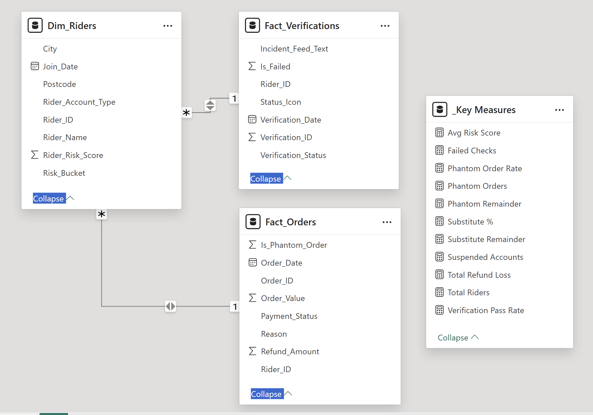

# Deliveroo: Trust & Safety Operations Console

 

> **Disclaimer:** This is a personal portfolio project utilizing a synthetic dataset to demonstrate operational dashboarding capabilities. It is a simulation of Gig Economy challenges and is not affiliated with Deliveroo.

**The Concept:** A "Single-Page Application" (SPA) style dashboard designed to mimic the live operational tools used by Rider Support and Fraud teams.

---

## 🧭 Mission Directive

### 🎯 The Goal
To engineer a **"Mission Control" Operations Console** that allows the Trust & Safety team to monitor **Rider Identity Compliance** and **Phantom Order Fraud** in real-time. This project shifts the focus from reactive monthly reporting to **Live Operational Intervention**.

### 📉 The Challenge
Deliveroo is facing a two-front crisis driven by regulatory pressure and operational fraud:
1.  **HMRC & Regulatory Pressure:** The UK government is cracking down on illegal working in the gig economy. Riders without "Right to Work" status are renting accounts via the **"Substitute Driver Scheme,"** creating a compliance black hole.
2.  **The "Phantom Order" Spike:** Fraudulent activity has surged to **17%**, driven by riders accepting orders, collecting the food, and failing to deliver it (marking it as "Delivered" or canceling).
3.  **Capital & Trust Loss:** Refund costs for "Cold Food," "Tampered Items," and "Missing Items" have ballooned to **£42.6K**, severely damaging customer trust.

---


## ⚡ Product Documentation
1.  [Product Vision & Impact](#-product-vision--impact) *(Executive Summary)*
2.  [User Stories & Problems Solved](#-user-stories--problems-solved) *(Key Business Questions)*
3.  [Backend Engineering](#-backend-engineering) *(Data Structure)*
4.  [App Interface Tour](#-app-interface-tour) *(Dashboard Deep Dive)*
5.  [Design System (Bento Grid)](#-design-system-bento-grid) *(UI/UX)*
6.  [Operational Optimizations](#-operational-optimizations) *(Strategic Recs)*
7.  [Future Iterations](#-future-iterations) *(Assumptions)*
8.  [Tech Stack & Code](#-tech-stack--code) *(Technical Implementation)*
9.  [Event Log Definitions](#-event-log-definitions) *(Data Dictionary)*
---

## 🏆 Product Vision & Impact

This dashboard serves as the central nervous system for the Operations team, allowing them to block fraudulent accounts and minimize capital leakage immediately.

**Quantified Impact:**
*   **Fraud Detection:** Isolated a **17% Phantom Order Rate**, identifying specific riders utilizing the "Substitute" loophole to commit theft.
*   **Capital Protection:** Tracked **£42.6K** in monthly refund losses, enabling the finance team to attribute 35% of losses directly to "High Risk" rider segments.
*   **Compliance Velocity:** Replaced manual CSV checks with a **Live Verification Feed**, flagging failed facial recognition checks in real-time.
*   **Risk Segmentation:** Discovered that **21%** of the fleet acts as "Substitutes," a segment that correlates with a **3x higher fraud rate** than standard Account Holders.

---

## ❓ User Stories & Problems Solved

| Stakeholder | Business Question | Solution Delivered |
| :--- | :--- | :--- |
| **Trust & Safety Lead** | "Are substitute riders causing more fraud?" | **Loss Attribution Chart** proves Substitutes drive disproportionate refunds despite lower volume. |
| **Ops Manager** | "Which cities are seeing a spike in theft?" | **Regional Hotspots Matrix** isolates Liverpool and Leeds as the current high-risk zones. |
| **Compliance Officer** | "Who failed a facial scan today?" | **Live Verification Feed** logs every failed ID check with timestamps for immediate banning. |
| **Finance Director** | "How much are phantom orders costing us?" | **Total Refund Loss KPI** (£43K) tracks the direct P&L impact of fraud. |

---

## 🗂 Backend Engineering

The data model is architected as a robust **Star Schema** to ensure high performance and enable cross-filtering between Financial (Orders), Operational (Verifications), and Demographic (Riders) data.



*   **Fact Tables (The Events):**
    *   `Fact_Orders`: Contains granular order logs, refund amounts, Phantom flags, and reason codes (e.g., "Cold Food").
    *   `Fact_Verifications`: Logs the biometric facial scans and Right-to-Work checks required by HMRC.
*   **Dimension Table (The Context):**
    *   `Dim_Riders`: Stores Rider IDs, Risk Scores (AI-generated), Account Types (Holder vs. Substitute), and City.
*   **Relationships:**
    *   Strict **One-to-Many (1:*)** relationships flowing from `Dim_Riders` to both Fact tables. This ensures that filtering by a Rider Attribute (e.g., "Substitute") instantly filters both Financial and Compliance data.

---

## 🔍 App Interface Tour

This is a **Single-Page Application (SPA)** designed for density and speed. It is divided into 14 distinct visual elements across 3 logical zones.


### Zone 1: The HUD (Heads-Up Display)
*The Top Row contains 6 Strategic KPIs designed as "Status Indicators."*

1.  **Total Riders (5K):**
    *   *Metric:* Total active fleet size.
    *   *Visual:* **Teal Ring**.
    *   *Insight:* Monitors fleet scalability. A sudden drop indicates mass churning or ban waves.
2.  **Total Refund Loss (£43K):**
    *   *Metric:* Capital lost due to refunds (Theft + Errors).
    *   *Visual:* **Red Alert Badge (▲ 12%)**.
    *   *Insight:* The primary P&L metric. The red trend indicates losses are accelerating MoM.
3.  **Phantom Orders (17%):**
    *   *Metric:* % of orders marked as "Delivered" but reported missing by customers.
    *   *Visual:* **Red Progress Ring**.
    *   *Insight:* 17% is a critical breach (Target < 2%). This indicates a coordinated fraud attack.
4.  **Substitute % (21%):**
    *   *Metric:* % of fleet using rented accounts.
    *   *Visual:* **Teal Progress Ring**.
    *   *Insight:* High substitute rates correlate with lower accountability. 21% is a high risk exposure.
5.  **Suspended Accounts (1K):**
    *   *Metric:* Total accounts banned for fraud/compliance.
    *   *Visual:* **Teal Ring**.
    *   *Insight:* Shows enforcement velocity. 1K suspensions vs 5K total riders suggests a massive "cleanup" operation is underway.
6.  **Failed Checks (336):**
    *   *Metric:* Failed Identity/Right-to-Work checks.
    *   *Visual:* **Red Alert Badge (▲ 16%)**.
    *   *Insight:* A spike here indicates riders are failing biometric scans, pointing to illegal account sharing.

### Zone 2: The Command Grid (Analytics)
*The Center Section focuses on Root Cause Analysis.*

7.  **Rider Risk Segmentation (Treemap):**
    *   *Logic:* Segments riders into High (Red), Medium (Grey), Low (Teal) based on Risk Score.
    *   *Insight:* The dominance of the **Red Block** visually screams that the fleet quality is toxic.
8.  **Regional Fraud Hotspots (Matrix):**
    *   *Logic:* Lists cities by Refund Loss and Phantom Count.
    *   *Visual:* **Red Data Bars** highlight magnitude.
    *   *Insight:* **Liverpool (£7,660)** is the #1 bleed point, proving that fraud is geographically concentrated, not random.
9.  **Primary Fraud Drivers (Bar Chart):**
    *   *Logic:* Breakdown of refund reasons.
    *   *Insight:* "Not Delivered" is the #1 reason, confirming that Phantom Orders (Theft) are a bigger issue than food quality (Cold Food).
10. **Loss Attribution: Account Type (Stacked Bar):**
    *   *Logic:* Compares financial loss between "Account Holders" and "Substitutes".
    *   *Insight:* Despite being only 21% of the fleet, Substitutes drive a disproportionate amount of loss.
11. **Capital Loss Timeline (Line Chart):**
    *   *Logic:* Monthly trend of refunds.
    *   *Insight:* The sharp spike in June/July correlates with the onboarding of new Substitute riders, validating the risk hypothesis.
12. **Enforcement Actions Trend (Area Chart):**
    *   *Logic:* Volume of suspensions over time.
    *   *Insight:* Enforcement is reactive; the spikes in bans follow the spikes in fraud.
13. **Identity Compliance Score (Gauge):**
    *   *Logic:* Current Verification Pass Rate vs 95% Target.
    *   *Visual:* **Teal Gauge**.
    *   *Insight:* Currently in the "Safe Zone" (Teal), but hovering near the limit.

### Zone 3: The Live Feed (Actionable Intel)
*The Right Sidebar is for real-time operations.*

14. **Rider Verification Audit (Log Table):**
    *   *Logic:* A raw feed of failed checks.
    *   *Columns:* **Status Icon** (⛔) | **Reason** (Failed - No Match) | **Rider ID**.
    *   *Usage:* This allows an Ops Agent to copy a Rider ID directly from the dashboard and paste it into the Admin Panel to issue a ban.

---

## 🎨 Design System

Unlike Executive Dashboards which use tabs, aggregation, and white space, this project utilizes a **"Mission Control"** philosophy.

*   **Zero-Click Navigation:** Operations teams do not have time to click tabs. All critical vectors (Fraud, Compliance, Finance) are visible at once.
*   **Status Color Logic:**
    *   **Teal (`#00CCBC`):** Safe / Operational / Scale.
    *   **Red (`#EB5757`):** Critical Risk / Fraud / Financial Loss.
    *   **Red (`#EB5757`):** Warning / Substitute Riders.
*   **Shadow DOM Effect:** Visuals use rounded corners and drop shadows to mimic the actual **Deliveroo Partner Hub** application, reducing cognitive load for users familiar with the platform.

---

## 💡 Operational Optimizations

Based on the console data, the following strategic interventions are recommended:

1.  **The "2-Digit PIN" Protocol:** To combat the **17% Phantom Order Rate**, implement a mandatory "Handshake" feature. Riders must input a 2-digit PIN provided by the customer upon delivery to mark the order as complete.
2.  **Substitute Verification Lockdown:** The data proves Substitutes are a high-risk vector. Implement a forced **Biometric Check** every 3 orders for Substitute accounts to ensure the person delivering matches the Right-to-Work documentation.
3.  **Geo-Fencing Liverpool:** With **£7,660** in losses, Liverpool is a fraud hotspot. Pause new rider onboarding in this region and audit the existing "High Risk" accounts immediately.

---

## 🧠 Future Iterations

### Assumptions
*   **Phantom Order:** Defined as an order accepted and collected by the rider but marked "Delivered" without reaching the customer, or canceled post-pickup.
*   **Substitute Rider:** An account holder who rents their profile to another individual.
*   **Risk Score:** A composite metric (0-100) based on tenure, refund frequency, and verification failures.

### Future Scope
*   **Python ML Integration:** Deploy a `Scikit-Learn` model to predict *future* Phantom Orders based on rider geolocation patterns.
*   **Real-Time API:** Connect the Power BI dataset to the live Deliveroo Ops API for sub-second latency (currently simulated via CSV).

---

## 🛠 Tech Stack & Code

### SQL Transformation (The "Brain")
*   **Note on Data Architecture:** While the portfolio demonstration utilizes a static dataset (Excel/CSV), the production data pipeline logic has been modeled in SQL to demonstrate scalability. See `scripts/Deliveroo_Ops_Transformation.sql` for the ELT logic.
*   **Key Techniques:**
    *   `LAG()` Window Function to detect spiraling fraud trends.
    *   `DENSE_RANK()` to tier cities by risk volume.
    *   `CTEs` to aggregate financial loss before joining to Rider dimensions.

### DAX (Data Analysis Expressions)
*   **Dynamic Risk Logic:**
    ```dax
    Suspended Accounts = 
    CALCULATE(
        COUNTROWS(Dim_Riders),
        FILTER(
            Dim_Riders,
            Dim_Riders[Risk_Score] > 90 || 
            CALCULATE(COUNTROWS(Fact_Verifications), Fact_Verifications[Is_Failed] = 1) > 0
        )
    )
    ```

---

## 📖 Event Log Definitions

| Term | Definition | Logic Used |
| :--- | :--- | :--- |
| **Phantom Order** | A specific fraud type where food is stolen post-collection. | `Is_Phantom = 1` |
| **Substitute** | A rider account rented to a secondary driver. | `Account_Type = 'Substitute'` |
| **Verification Failure** | A failed facial scan or document check. | `Is_Failed = 1` |
| **Capital Loss** | The total value of refunds processed due to rider error/fraud. | `SUM(Refund_Amount)` |

---
*Author: Sagar Chaandwani*
